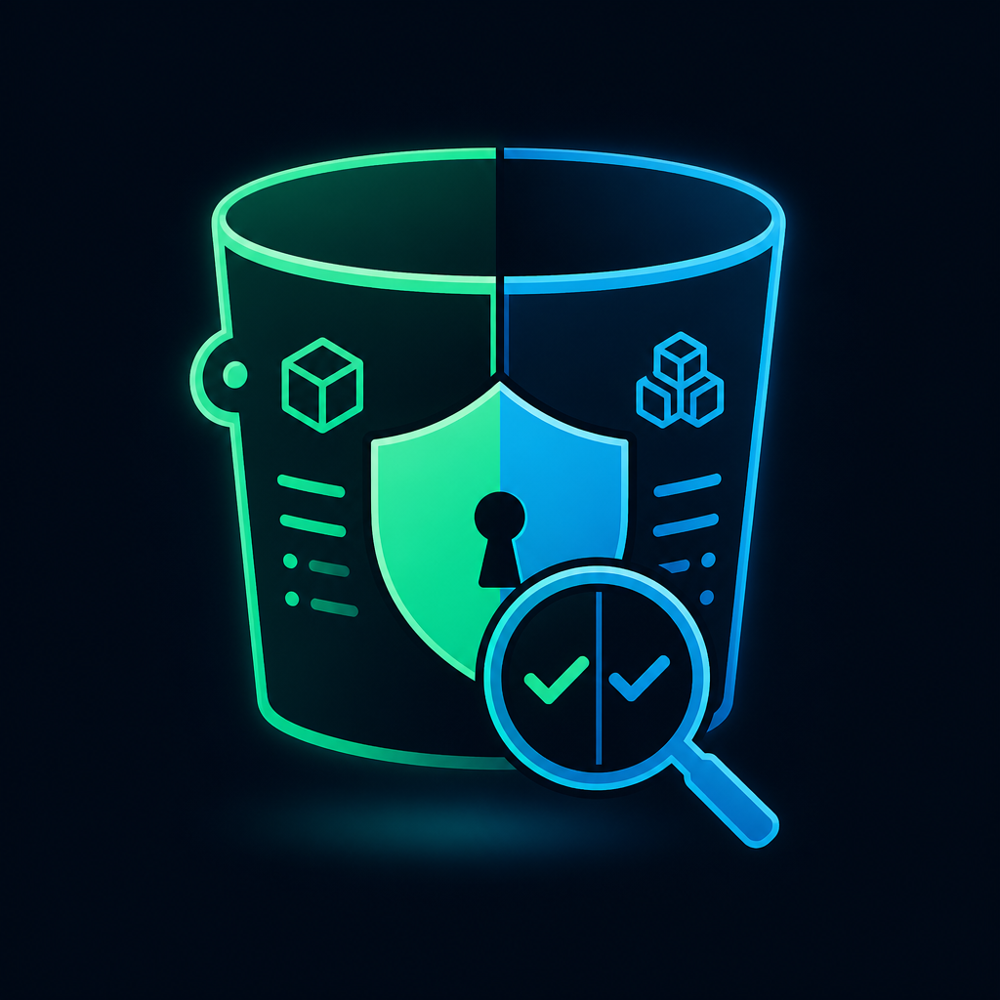
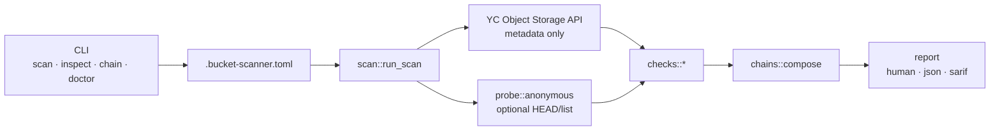

<p align="center">
  
</p>

<h1 align="center">Bucket Scanner</h1>

<p align="center">
  <strong>Declared vs real.</strong> Object Storage security scanner (Yandex Cloud + AWS S3 + Azure preview).<br/>
  What you configured · what ACL allows · what the internet can actually reach.
</p>

<p align="center">
  <a href="https://github.com/FounderB/BucketScanner/actions"></a>
  
  
  
  
  <a href="LICENSE"></a>
  
</p>

<p align="center">
  <a href="https://github.com/FounderB/FluxTap">FluxTap</a> ·
  <a href="https://github.com/FounderB/Tracefuse">Tracefuse</a> ·
  <a href="https://github.com/FounderB/Timeforge">Timeforge</a> ·
  <a href="https://github.com/FounderB/SignShield">SignShield</a> ·
  <b>Bucket Scanner</b>
</p>

---

## Why

Buckets drift. ACL says `private`, policy leaks `public-read`. Versioning is off, logging never enabled, a service account key outlived three rotations — and nobody noticed until exfil.

Bucket Scanner walks your **Object Storage** (Yandex Cloud by default, **AWS S3** optional) and surfaces gaps between **what you declare** and **what actually ships**:

| You declare | Bucket Scanner checks |
|-------------|----------------------|
| Private bucket | Anonymous `HEAD` / list probe |
| Encryption at rest | Server-side encryption flags per bucket |
| Audit trail | Access logging enabled |
| Ransomware resilience | Versioning + lifecycle sanity |
| Least privilege | SA bindings → blast radius chains |

Metadata scan by default. Optional live probe proves reachability — **without downloading object bodies**.

```
╔══════════════════════════════════════════════════════════╗
║                      BUCKET SCANNER                      ║
║        declared vs real · object storage truth           ║
╚══════════════════════════════════════════════════════════╝

  score  42  ████████░░░░░░░░░░░░
  CRIT 1  HIGH 4  MED 7  LOW 2  INFO 3

  CHAIN  public-read + no-logging + stale-sa-key → silent exfil path
```

Part of the **FounderB security stack**: [Tracefuse](https://github.com/FounderB/Tracefuse) watches what you ship · [FluxTap](https://github.com/FounderB/FluxTap) watches the wire · **Bucket Scanner** watches what you store.

---

## Install

**From PyPI** (recommended):

```bash
pip install bucket-scanner
bucket-scanner --help
```

**From source** (development):

```bash
git clone https://github.com/FounderB/BucketScanner.git
cd BucketScanner
python3 -m venv .venv && source .venv/bin/activate
pip install -e ".[dev]"
make hooks   # install local git author guard
```

See [docs/PYPI.md](docs/PYPI.md) for version pins and maintainer publishing.

**Requirements:** Python **3.11+**, Yandex Cloud credentials (default) or AWS credentials (`--cloud aws`). See [docs/AWS.md](docs/AWS.md).

---

## AWS S3 (optional)

```bash
export AWS_REGION=us-east-1
bucket-scanner scan --cloud aws
bucket-scanner scan --cloud aws --fixture examples/demo-vulnerable/fixture-aws.toml
bucket-scanner doctor --cloud aws
```

## Azure Blob (fixture-only preview)

```bash
bucket-scanner scan --cloud azure --fixture examples/demo-vulnerable/fixture-azure.toml
bucket-scanner explain azure/container-public-access
```

Live Azure inventory is planned; see [docs/AZURE.md](docs/AZURE.md).

---

## 60-second wow

All values under `examples/demo-vulnerable/` are labeled **FAKE / EXAMPLE**.

```bash
# Offline demo — no cloud credentials required
bucket-scanner scan --fixture examples/demo-vulnerable/fixture.toml
bucket-scanner scan --fixture examples/demo-vulnerable/fixture.toml --json
bucket-scanner scan --fixture examples/demo-vulnerable/fixture.toml \
  --sarif /tmp/bucket-scanner.sarif --fail-on high

bucket-scanner scan --fixture examples/demo-vulnerable/fixture.toml \
  --repo examples/demo-vulnerable/repo \
  --tracefuse-report examples/demo-vulnerable/tracefuse-report.json \
  --prometheus /tmp/bucket-scanner.prom

# Prometheus + continuous monitoring
bucket-scanner serve --fixture examples/demo-vulnerable/fixture.toml --addr 127.0.0.1:9090

# Prove public exposure (anonymous probe, no object download)
bucket-scanner scan --folder-id b1gxxxxxxxxxx --probe
```

Expect findings across **acl**, **policy**, **encryption**, **logging**, **versioning**, **lifecycle**, **iam**, and **chains**. Exit `1` when policy fails; exit `2` on tool error.

---

## Quick start

```bash
export YC_TOKEN=$(yc iam create-token)          # or YC_SERVICE_ACCOUNT_KEY_FILE
export YC_CLOUD_ID=b1g...
export YC_FOLDER_ID=b1g...

bucket-scanner scan --folder-id "$YC_FOLDER_ID"
bucket-scanner scan --folder-id "$YC_FOLDER_ID" --probe --fail-on high
bucket-scanner doctor                           # creds, scopes, API reachability
bucket-scanner explain acl/public-read          # remediation + why
```

> **Probe mode** sends unauthenticated HTTP requests to bucket endpoints to verify real-world exposure. It never downloads object payloads — only checks reachability metadata.

---

## Features

| Detector | What it catches |
|----------|-----------------|
| **acl** | `public-read`, `public-read-write`, world-open grants |
| **policy** | Bucket policy statements wider than intent |
| **encryption** | Missing default encryption / SSE gaps |
| **logging** | No access logs on sensitive buckets |
| **versioning** | Versioning disabled on prod-like buckets |
| **lifecycle** | Aggressive expiration, incomplete multipart cleanup |
| **iam** | Over-broad SA roles, long-lived static keys |
| **chains** | Compound risk: public + no logs + no versioning + stale key |

Also: health score, `bucket-scanner init` → `.bucket-scanner.toml`, `doctor` / `explain`, severity overrides, quiet mode for CI, SARIF 2.1.0 for GitHub Code Scanning, **`diff`** for Terraform drift.

### Terraform drift

```bash
bucket-scanner diff examples/demo-vulnerable/terraform \
  --fixture examples/demo-vulnerable/fixture.toml

bucket-scanner scan --folder-id b1g... --terraform ./infra/storage/
```

---

## Why not the console?

| | YC Console / manual checklist | Bucket Scanner |
|---|---|---|
| Scope | One bucket at a time | Whole folder · repeatable |
| Proof | ACL text says private | **`--probe` proves** anonymous reachability |
| Output | Screenshots in tickets | **Redacted** human / JSON / SARIF |
| Policy | Spreadsheet | `--fail-on high` · GitHub Action |
| Chains | Siloed findings | **Misconfig graphs** — why it hurts together |
| Drift | Point-in-time | CI on every PR · scheduled scans |

Use Bucket Scanner when you need one gate that answers **“what does this folder *actually* risk?”** — not just “is there a public ACL string somewhere?”

---

## CLI

```bash
bucket-scanner init [--force] [path]           # write .bucket-scanner.toml
bucket-scanner doctor                          # creds, folder access, API health
bucket-scanner explain <rule-id>               # remediation (e.g. acl/public-read)
bucket-scanner scan --folder-id ID             # human report
bucket-scanner scan --folder-id ID --json      # JSON to stdout
bucket-scanner scan --folder-id ID --sarif out.sarif --fail-on high
bucket-scanner scan --folder-id ID --baseline baselines/prod.json --fail-on new
bucket-scanner scan --folder-id ID --write-baseline baselines/prod.json
bucket-scanner scan --folder-id ID --probe     # + anonymous reachability checks
bucket-scanner inspect BUCKET                  # single-bucket deep report
bucket-scanner chain --sa-id ID                # blast radius from one SA
bucket-scanner diff PATH                       # Terraform vs live/fixture
bucket-scanner serve --addr 127.0.0.1:9090     # /metrics + /health
bucket-scanner list --folder-id ID             # inventory summary
```

**Exit codes:** `0` clean / below threshold · `1` policy fail · `2` tool error.

Default `fail_on` in config is `high` (overridable via `--fail-on` or `.bucket-scanner.toml`).

---

## Configuration

`bucket-scanner init` writes `.bucket-scanner.toml`:

```toml
[scan]
folder_id = "b1gxxxxxxxxxx"
fail_on = "high"
probe = false

[scan.ignore_buckets]
names = ["public-assets-cdn"]

[[scan.severity_overrides]]
rule = "versioning/disabled"
severity = "medium"
```

See [docs/CONFIGURATION.md](docs/CONFIGURATION.md) for full reference.

---

## Architecture



Details: [docs/ARCHITECTURE.md](docs/ARCHITECTURE.md) · [docs/CHECKS.md](docs/CHECKS.md)

---

## GitHub Actions

Minimal scan + SARIF upload. Full guide: [docs/GITHUB_ACTION.md](docs/GITHUB_ACTION.md).

```yaml
name: bucket-scanner
on:
  pull_request:
  push:
    branches: [main]
  schedule:
    - cron: "0 6 * * *"

permissions:
  contents: read
  security-events: write

jobs:
  scan:
    runs-on: ubuntu-latest
    steps:
      - uses: actions/checkout@v4
      - uses: actions/setup-python@v5
        with:
          python-version: "3.11"
      - run: pip install .
      - name: Scan YC folder
        env:
          YC_TOKEN: ${{ secrets.YC_TOKEN }}
          YC_FOLDER_ID: ${{ secrets.YC_FOLDER_ID }}
        run: |
          bucket-scanner scan --folder-id "$YC_FOLDER_ID" \
            --sarif bucket-scanner.sarif --fail-on high -q
      - name: Upload SARIF
        if: always()
        uses: github/codeql-action/upload-sarif@v3
        with:
          sarif_file: bucket-scanner.sarif
```

---

## Security promises

- **Metadata by default** — list buckets, ACLs, policies, settings; no bulk object download.
- **Probe is opt-in** — anonymous HTTP checks only when you pass `--probe`.
- **Redaction** — SA key fragments, tokens, and sensitive URLs redacted in all report formats.
- **Offline fixtures** — `examples/demo-vulnerable/` uses clearly labeled **FAKE/EXAMPLE** values only.

See [SECURITY.md](SECURITY.md) and [docs/AUDIT.md](docs/AUDIT.md).

---

## Roadmap

- [x] Tracefuse hook — leaked `YC_*` in repo → cross-finding
- [x] Prometheus exporter + Grafana dashboard
- [x] Scheduled drift alerts (Telegram / webhook)
- [x] AWS S3 backend (optional second cloud)
- [x] Multi-region AWS inventory (per-bucket region resolution)
- [x] Scheduled scan profiles in config
- [x] CI/CD profile workflows (Action + scheduled matrix)
- [x] Baseline/delta + suppressions for production CI gates
- [x] Security hardening + audit docs (v0.11)
- [x] PyPI package (`pip install bucket-scanner`)
- [ ] Azure Blob live scan
- [ ] GCS backend

---

## License

MIT © FounderB — [LICENSE](LICENSE).

## Contributing

[CONTRIBUTING.md](CONTRIBUTING.md) · [CHANGELOG.md](CHANGELOG.md)
