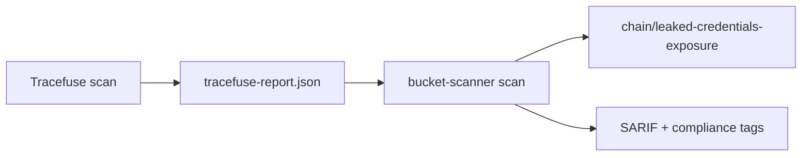

# Tracefuse cross-stack integration

Bucket Scanner can import **Tracefuse** JSON reports to correlate repository secret findings with live bucket exposure — the `chain/leaked-credentials-exposure` misconfig chain.

## Flow



1. Run Tracefuse (or compatible tooling) against your repo.
2. Export findings as JSON (`findings` array).
3. Pass the report to Bucket Scanner:

```bash
bucket-scanner scan \
  --fixture examples/demo-vulnerable/fixture.toml \
  --repo examples/demo-vulnerable/repo \
  --tracefuse-report examples/demo-vulnerable/tracefuse-report.json \
  --compliance-report /tmp/compliance.json \
  --fail-on high
```

## Supported cloud markers

Tracefuse findings are imported when their payload matches cloud-related markers:

| Cloud | Markers |
|-------|---------|
| Yandex Cloud | `yc_`, `yandex`, `storage.yandexcloud`, `authorized_key` |
| AWS | `akia`, `aws_`, `amazon`, `s3.amazonaws.com`, `secretsmanager` |
| Azure | `azure`, `azurerm`, `blob.core.windows.net`, `client_secret` |
| GCS | `gcp`, `google`, `gserviceaccount`, `storage.googleapis.com`, `google_storage` |

Imported findings use rule IDs prefixed with `tracefuse/` and appear in SARIF compliance tags (`NIST-IA-5`, `SOC2-CC6.1`).

## GitHub Action

```yaml
- uses: FounderB/BucketScanner/action@v1.5.0
  with:
    version: "1.5.0"
    profile: stack-fixture
    config-path: examples/ci/.bucket-scanner.toml
    tracefuse-report: tracefuse-report.json
    repo-path: .
    compliance-report-path: compliance.json
```

## CI profile

The `stack-fixture` profile in `examples/ci/.bucket-scanner.toml` bundles fixture scan, repo secrets, Tracefuse report, and Terraform drift for offline demos.
